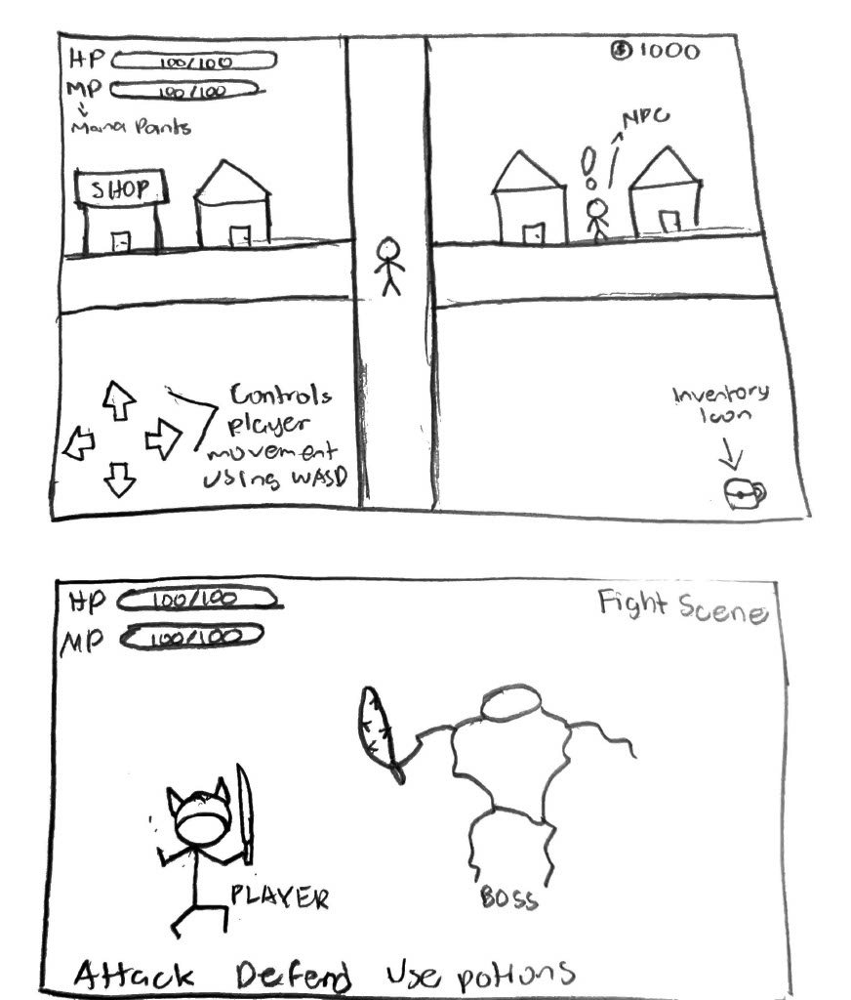

:warning: Everything between << >> needs to be replaced (remove << >> after replacing)

# Sticks and Stones
## CS110 Final Project  Fall 2024

## Team Members

Lance Enriquez

***

## Project Description

An adventure game where the character can interact with NPC's(non-playable characters)
,fight enemies, and buy/sell items.

***    

## GUI Design

### Initial Design

### Final Design

## Program Design

### Features

1. start menu
2. moveable character using arrow keys
3. buy/sell items
4. interact with npc's
5. show health bar/mana bar
6. access items in an inventory or storage
7. create buttons that give player decisions when fighting enemies
8. screen that tells you win or lose when fighting an enemy

### Classes

- << You should have a list of each of your classes with a description >>

## ATP

| Step                 |Procedure             |Expected Results                   |
|----------------------|:--------------------:|----------------------------------:|
|  1                   | Run Counter Program  |GUI window appears with count = 0  |
|  2                   | click count button   | display changes to count = 1      |
etc...
